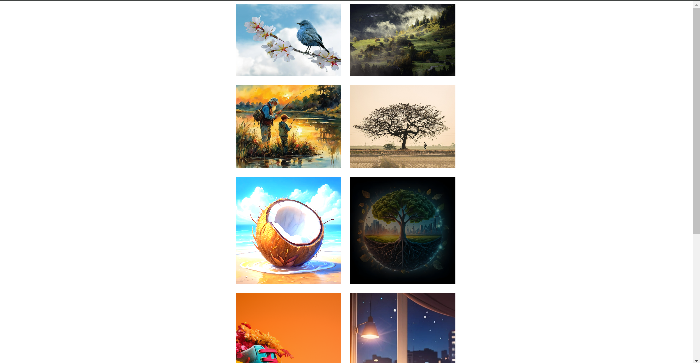

<h1>Image Hover Zoom Challenge</h1>

Create a responsive grid of images with engaging hover effects using HTML and CSS.

<h2>Table of Contents</h2>
<ul>
    <li><a href="#introduction">Introduction</a></li>
    <li><a href="#purpose">Purpose</a></li>
    <li><a href="#prerequisites">Prerequisites</a></li>
    <li><a href="#file-structure">File Structure</a></li>
    <li><a href="#tools">Tools</a></li>
    <li><a href="#preview">Preview</a></li>
    <li><a href="#contributing">Contributing</a></li>
</ul>

<h2 id="introduction">Introduction</h2>

This challenge involves creating a grid of images that react dynamically when hovered over. Each image zooms in and applies unique transformations, providing a visually engaging experience for users. The challenge is designed to practice and enhance your HTML and CSS skills, specifically focusing on grid layouts and hover effects.

<h2 id="purpose">Purpose</h2>

The purpose of this challenge is to:

<ul>
    <li>Practice creating responsive grid layouts with CSS.</li>
    <li>Explore different CSS hover effects and transitions.</li>
    <li>Enhance your understanding of CSS transformations and animations.</li>
    <li>Improve your ability to create visually appealing web pages using only HTML and CSS.</li>
</ul>

<h2 id="prerequisites">Prerequisites</h2>

Before you begin, ensure you have the following:

<ul>
    <li>Basic knowledge of HTML and CSS.</li>
</ul>

<h2 id="file-structure">File Structure</h2>

Here’s the file structure for this challenge:

<pre>
image-hover-zoom-challenge/
├── index.html
├── styles.css
├── images/
│   ├── image-1.jpeg
│   ├── image-2.jpg
│   ├── image-3.jpeg
│   ├── image-4.jpg
│   ├── image-5.jpeg
│   ├── image-6.jpeg
│   ├── image-7.jpeg
│   ├── image-8.jpeg
│   ├── image-9.jpeg
│   └── image-10.jpeg
</pre>

<h2 id="tools">Tools</h2>

The tools used for this challenge are:

<ul>
    <li>A code editor (e.g., VSCode, Sublime Text).</li>
    <li>A web browser (e.g., Chrome, Firefox) for testing.</li>
</ul>

<h2 id="preview">Preview</h2>

Here’s a preview of the Image Hover Zoom Challenge:

<a href="https://codepen.io/Yashi-the-lessful/pen/zYQVpGJ" target="_blank">Live Demo</a> (Replace with your live demo link)

Preview

<h2 id="contributing">Contributing</h2>

We welcome contributions to enhance the Image Hover Zoom Challenge! Whether you want to fix bugs, add new features, or improve the documentation, your help is greatly appreciated. Please follow these guidelines to contribute:

<h3>How to Contribute</h3>
<ol>
    <li><strong>Fork the Repository</strong></li>
    <li><strong>Clone the Repository</strong>
        <ul>
            <li>Clone the forked repository to your local machine using the following command:
                <pre>git clone https://github.com/Yashi-Singh-1/Image-Hover-Zoom-Challenge.git</pre>
            </li>
        </ul>
    </li>
    <li><strong>Create a New Branch</strong>
        <ul>
            <li>Navigate to the project directory:
                <pre>cd Image-Hover-Zoom-Challenge</pre>
            </li>
            <li>Create a new branch for your feature or bug fix:
                <pre>git checkout -b feature/your-feature-name</pre>
                Replace <code>your-feature-name</code> with a descriptive name for your branch.
            </li>
        </ul>
    </li>
    <li><strong>Make Your Changes</strong>
        <ul>
            <li>Implement your changes in the new branch.</li>
            <li>Ensure your code follows the project's coding standards and conventions.</li>
            <li>Test your changes thoroughly.</li>
        </ul>
    </li>
    <li><strong>Commit Your Changes</strong>
        <ul>
            <li>Stage your changes:
                <pre>git add .</pre>
            </li>
            <li>Commit your changes with a descriptive commit message:
                <pre>git commit -m "Add your descriptive commit message"</pre>
            </li>
        </ul>
    </li>
    <li><strong>Push Your Changes</strong>
        <ul>
            <li>Push your changes to your forked repository:
                <pre>git push origin feature/your-feature-name</pre>
            </li>
        </ul>
    </li>
    <li><strong>Submit a Pull Request</strong>
        <ul>
            <li>Navigate to the original repository on GitHub.</li>
            <li>Click the "New Pull Request" button.</li>
            <li>Select your branch from the "Compare" dropdown.</li>
            <li>Add a descriptive title and detailed description of your changes.</li>
            <li>Submit the pull request.</li>
        </ul>
    </li>
</ol>

<h3>Guidelines for Contributing</h3>
<ul>
    <li><strong>Code Style</strong>
        <ul>
            <li>Follow the existing code style and conventions used in the project.</li>
            <li>Ensure your code is clean, well-commented, and easy to understand.</li>
        </ul>
    </li>
    <li><strong>Commit Messages</strong>
        <ul>
            <li>Write clear and concise commit messages.</li>
            <li>Use the imperative mood in the subject line (e.g., "Add new hover effect").</li>
        </ul>
    </li>
</ul>

Thank you for contributing to the Image Hover Zoom Challenge! Your contributions help make this project better for everyone.
